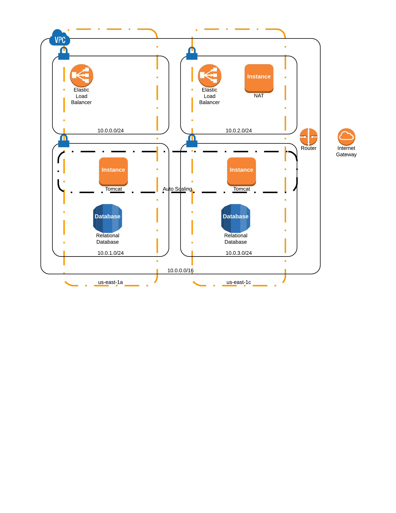

Overview
-----------------

The create_vpn.rb script creates a VPC with four subnets - two public and two
private. For this sample we need two AZs for our VPC-specific RDS instance.

Note for elastic load balancing, load balancers are placed in public subnets,
with security group ingress configuration for the private subnets gating
access. So for this sample we create two public subnets (one in each AZ) to
allow ELB to route traffic to private servers in the AZs.

To create the set up above, follow these steps.

1. In the directory above the one containing these scripts, create a
   config.yml file to contain the IAM access key id and secret access key
   you intend to use when running the scripts. Note you will need the
   appropriate access policies associated with your IAM user as described below.

        vagrant@precise64:/vagrant/dev/aws-ruby-samples$ cat ../config.yml
        access_key_id: akeyid
        secret_access_key: asecretaccesskey

2. Create the VPC by running create_vpc.rb

        ruby create_vpc.rb

3. Create the security groups by running create_security_groups

        ruby create_security_groups.rb

4. Create an RDS instance within a subnet group containing the private
   subnets. The easiest way to do this is to use an existing snapshot
   to do so, e.g.

        ruby launch_rds_from_snapshot.rb vpc-8b27e6ee b2bnext-db b2bnext-with-idx

    Note this creates the instance with the default RDS security group,
    which is likely not accessible from anywhere. Once the database
    is available, you can update its security group to allow ingress
    from the private subnets.

        ruby update_db_security_group.rb vpc-8b27e6ee b2bnext-db

   If you want to create an RDS instance from scratch, look at the
   orig/launch_rds.rb script

5. Once the database is available, presuming you need the endpoint
   address, you can launch an EC2 instance, install and configure
   your application on it, and create an image to use with an auto
   scaling group.

   When the image is available, you can create the launch configuration
   that references the image.

        ruby create_launch_config.rb vpc-8b27e6ee ami-4409ec2c

6. Once the image is available, the load balancer and auto scaling
   group can be created.

        ruby create_load_balancer.rb vpc-8b27e6ee b2bnext-lb
        ruby create_auto_scaling_group.rb vpc-8b27e6ee b2bnext-lb

Permissions
----------------

Running the scripts required some additional policies granting API access
for load balancer and auto scaling configuration. Here are the
additional policies I had to create:

    {
      "Version": "2012-10-17",
      "Statement":[{
      "Effect":"Allow",
      "Action":[
          "autoscaling:*LaunchConfiguration*",
          "autoscaling:*DescribeAutoScalingGroups*",
          "autoscaling:DescribePolicies",
          "autoscaling:CreateAutoScalingGroup",
          "autoscaling:PutScalingPolicy"
      ],
      "Resource":"*"
      }
      ]
    }

    {
      "Version": "2012-10-17",
       "Statement":[{
          "Effect":"Allow",
          "Action":["cloudwatch:DescribeAlarms",
                    "cloudwatch:PutMetricAlarm"
          ],
          "Resource":"*"
          }  
       ]
    }

    {
      "Version": "2012-10-17",
      "Statement":[{
        "Effect":"Allow",
        "Action":["elasticloadbalancing:CreateLoadBalancer",
                "elasticloadbalancing:ConfigureHealthCheck",
                "elasticloadbalancing:DeleteLoadBalancer"],
                "Resource":"*"
              }  
      ]
    }  

These were added to a group baselined with the following policy:

    {
    "Version": "2012-10-17",
    "Statement": [
      {
        "Sid": "Stmt1335291234152",
        "Action": [
          "cs:*"
        ],
        "Effect": "Allow",
        "Resource": [
          "*"
        ]
      },
      {
        "Sid": "Stmt1385132429000",
        "Effect": "Allow",
        "Action": [
          "ec2:*"
        ],
        "Resource": [
          "*"
        ]
      },
      {
        "Sid": "Stmt1385132449000",
        "Effect": "Allow",
        "Action": [
          "rds:*"
        ],
        "Resource": [
          "*"
        ]
      },
      {
        "Sid": "Stmt1385132492000",
        "Effect": "Allow",
        "Action": [
          "s3:*"
        ],
        "Resource": [
          "*"
        ]
      },
      {
        "Sid": "Stmt1385132502000",
        "Effect": "Allow",
        "Action": [
          "sqs:*"
        ],
        "Resource": [
          "*"
        ]
      },
      {
        "Sid": "Stmt1385132542000",
        "Effect": "Allow",
        "Action": [
          "dynamodb:*"
        ],
        "Resource": [
          "*"
        ]
      }
    ]
    }

Oracle Connection Details
-----------------------------

To connect to the RDS instance, launch an EC2 server in the VPC. You will need to install the Oracle instant
client - grab it from the OTN [here](http://www.oracle.com/technetwork/topics/linuxx86-64soft-092277.html)

You will need the basic and sqlplus RPMs.

The RPMs are installed on the Amazon AMI via

    rpm -i oracle-instantclient12.1-basic-12.1.0.1.0-1.x86_64.rpm
    rpm -i oracle-instantclient12.1-sqlplus-12.1.0.1.0-1.x86_64.rpm

The lib and bin directories located here:

    /usr/lib/oracle/12.1/client64/lib
    /usr/lib/oracle/12.1/client64/bin

To use sqlplus, update your PATH and LD_LIBRARY_PATH settings in your .bash_profile

    PATH=$PATH:$HOME/bin:/usr/lib/oracle/12.1/client64/bin
    LD_LIBRARY_PATH=/usr/lib/oracle/12.1/client64/lib:$LD_LIBRARY_PATH
    export PATH
    export LD_LIBRARY_PATH

Now you can connect to your oracle RDS instance:

    sqlplus 'user@(DESCRIPTION=(ADDRESS=(PROTOCOL=TCP)(HOST=aws-host)(PORT=1521))(CONNECT_DATA=(SID=RDS-SID)))'

When I tried this initially, I received the following error:

    ERROR:
    ORA-21561: OID generation failed

The solution was to edit /etc/hosts to include the hostname in the localhost line:

    127.0.0.1   localhost ip-10-0-0-93

Ruby Setup - Vagrant VM
--------------------------

Working behind an HTTP proxy? Export http_proxy and https_proxy variables in
.bashrc and source it.

You will need to have those variables propogate to the sudo context as well. To
do so, edit /etc/sudoers and add two defaults.

    Defaults  env_keep += "http_proxy"
    Defaults  env_keep += "https_proxy"

Now grab curl, and install RVM

    sudo apt-get install curl
    curl -sSL https://get.rvm.io | bash -s stable --ruby

Follow the post install instructions, e.g.

    source /home/vagrant/.rvm/scripts/rvm

Install and configure git

    sudo apt-get install git
    git config --global http.proxy <proxy-url>
    git config --global https.proxy <proxy-url>
    git config --global user.name <user name>
    git config --global user.email <email>

Now install the AWS gem

    gem install --http-proxy <proxy-url-and-port> aws-sdk
